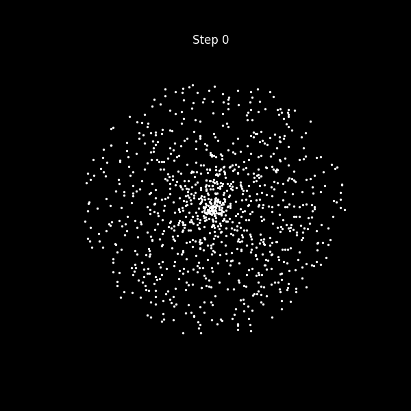

# N-Body Gravity Simulation (CUDA)

A GPU-accelerated all-pairs N-body gravity simulation, built in CUDA C++ and visualized with Python. Bodies are initialized in a rough disk with orbital velocity and evolve under mutual gravitational attraction, computed in parallel on the GPU at every timestep.

## Background

The all-pairs force calculation and shared-memory tiling structure are based on the approach described in **[GPU Gems 3, Chapter 31: Fast N-Body Simulation with CUDA](https://developer.nvidia.com/gpugems/gpugems3/part-v-physics-simulation/chapter-31-fast-n-body-simulation-cuda)** (Nyland, Harris, Prins). The chapter's derivation of the softened gravitational force equation and its tile-based shared-memory strategy were used as the conceptual reference.

The code itself is my own independent implementation, not a copy of the chapter's example code. 

## What it does

- Simulates N bodies interacting under Newtonian gravity, using the brute-force all-pairs method (every body's force is the sum of its interaction with every other body)
- Uses a softened force law to avoid singularities when bodies pass close to one another
- Computes forces on the GPU using shared-memory tiling: bodies are loaded into shared memory in batches, so threads in a block reuse data instead of repeatedly hitting global memory
- Integrates motion forward in time with a semi-implicit Euler scheme (velocity updated from acceleration, then position updated from the new velocity)
- Saves body positions at intervals to CSV files, which a Python script animates into a GIF

## The physics

For bodies `i` and `j`, the softened gravitational acceleration contribution is:

a_i += G * m_j * r_ij / (|r_ij|^2 + eps^2)^(3/2)

where `r_ij` is the vector from body `i` to body `j`, and `eps` is a small softening constant that prevents the force from diverging as bodies approach zero separation.

## GPU implementation

- **`body_body_force_calc`** — computes one pairwise interaction, accumulating into a acceleration accumulator passed by pointer
- **`tile_calculation`** — loops a thread through the `p` bodies currently held in shared memory, skipping the case where a body would interact with itself
- **`calculate_forces`** — the kernel. Each thread owns one body. It steps through `N/p` tiles, cooperatively loading `p` bodies into shared memory each time, synchronizing before and after use, and accumulating the total force into a local (register) variable. Acceleration is written back to global memory once, after all tiles are processed, rather than on every interaction. Velocity and position are then integrated in the same kernel launch.

## Visualization

`visualize.py` reads the saved CSV frames and renders them as an animated GIF using matplotlib, plotting each body's x/y position over time.

## Running it
